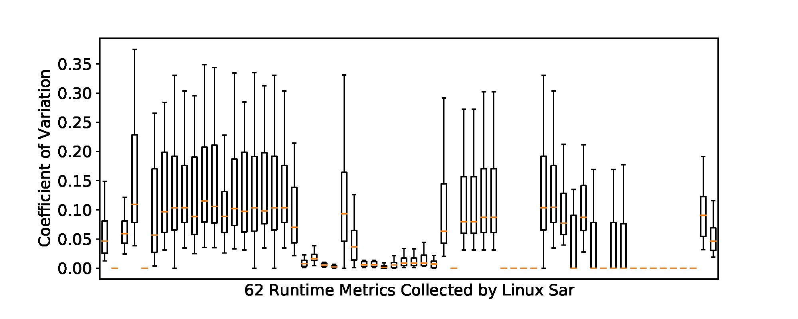
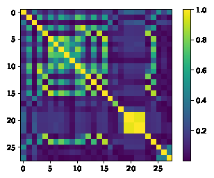
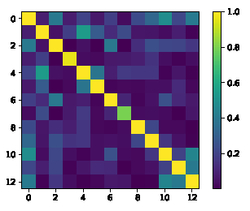

# Introduction
This data repository includes large-scale performance data on Alibaba Cloud, HUAWEI Cloud, Tencent Cloud ans AWS. Since performance varies with different inputs, our data includes multiple combinations of applications and inputs. We use workload to describe an application and its input. The workloads are extracted from HiBench and BigDataBench.

## VM Types

### Alibaba Cloud
* g6.large, g6.xlarge, g6.2xlarge
* c6.large, c6.xlarge, c6.2xlarge
* r6.large, r6.xlarge, r6.2xlarge
* hfg6.large, hfg6.xlarge, hfg6.2xlarge
* hfc6.large, hfc6.xlarge, hfc6.2xlarge
* hfr6.large, hfr6.xlarge, hfr6.2xlarge

### HUAWEI Cloud
* s6.large.2, s6.large.4, s6.xlarge.2, s6.xlarge.4, s6.2xlarge.2, s6.2xlarge.4
* c6.large.2, c6.large.4, c6.xlarge.2, c6.xlarge.4, c6.2xlarge.2, c6.2xlarge.4
* m6.large.8, m6.xlarge.8, m6.2xlarge.8

### Tencent Cloud
* s5.medium4, s5.medium8, s5.large8, s5.large16, s5.2xlarge16, s5.2xlarge32
* c3.large8, c3.large16, c3.2xlarge16, c3,2xlarge32
* m5.medium16, m5.large32, m5.2xlarge64

### AWS
* m5.large, m5.xlarge, m5.2xlarge
* c5.large, c5.xlarge, c5.2xlarge
* r5.large, r5.xlarge, r5.2xlarge

## Features

### Raw Features

There are 62 raw features as follows:

**[CPU features]** %user,%nice,%system,%iowait,%steal,%idle

**[Disk Features]** tps,rd_sec/s,wr_sec/s,avgrq-sz,avgqu-sz,await,svctm,%util

**[I/O Features]** tps,rtps,wtps,bread/s,bwrtn/s

**[Load Features]** runq-sz,plist-sz,ldavg-1,ldavg-5,ldavg-15,blocked

**[Memory Features]** kbmemfree,kbmemused,%memused,kbbuffers,kbcached,kbcommit,%commit,kbactive,kbinact,kbdirty

**[Network Features]** IFACE,rxpck/s,txpck/s,rxkB/s,txkB/s,rxcmp/s,txcmp/s,rxmcst/s,%ifutil

**[Paging Features]** pgpgin/s,pgpgout/s,fault/s,majflt/s,pgfree/s,pgscank/s,pgscand/s,pgsteal/s,%vmeff

**[Swap Features]** pswpin/s,pswpout/sf,kbswpfree,kbswpused,%swpused,kbswpcad,%swpcad

**[Task Features]** proc/s,cswch/s

### Features with High Coefficient of Variation (CV)

CV of All Raw Features:

After Removing features with low CV, the following 28 features are left:

**[CPU features]** %system,%iowait,%idle

**[Disk Features]** tps,rd_sec/s,wr_sec/s,avgrq-sz,avgqu-sz,await,svctm,%util

**[I/O Features]** tps,rtps,wtps,bread/s,bwrtn/s

**[Load Features]** runq-sz,blocked

**[Memory Features]** kbdirty

**[Network Features]** rxpck/s,txpck/s,rxkB/s,txkB/s

**[Paging Features]** pgpgin/s,pgpgout/s,fault/s,pgfree/s

**[Task Features]** cswch/s

### Features De-duplication

Correlation Coefficient (COR) of 28 selected features:

Correlation Coefficient (COR) of 13 selected features after de-duplication:

After de-duplication (removing features with high correlation), the following 13 features are left:

**[CPU features]** %system,%iowait,%idle

**[Disk Features]** tps,rd_sec/s,await

**[I/O Features]** bwrtn/s

**[Load Features]** runq-sz,blocked

**[Memory Features]** kbdirty

**[Paging Features]** fault/s,pgfree/s

**[Task Features]** cswch/s
